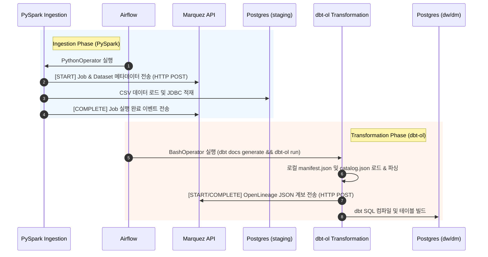
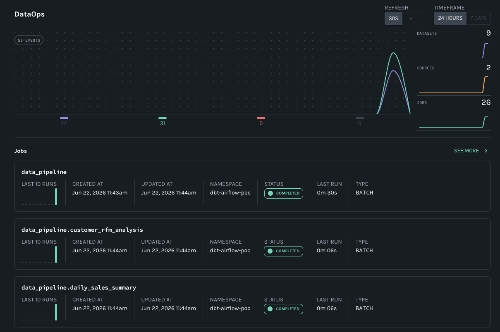
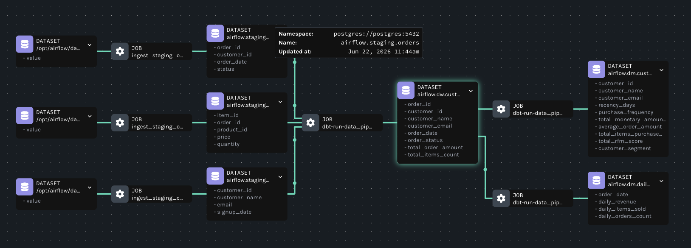
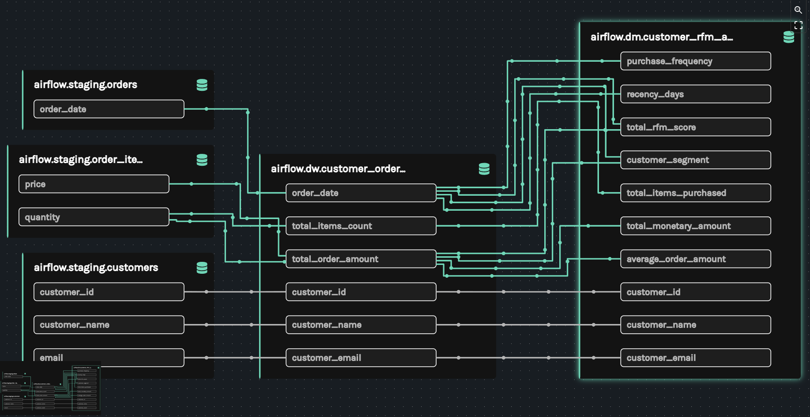

# Airflow-OpenLineage-Marquez PoC

이 프로젝트는 **Apache Airflow 3.x**, **dbt Core**, **PySpark**, **OpenLineage**, 그리고 **Marquez**를 연동하여, 데이터 파이프라인의 **컬럼 수준 데이터 계보(Column-Level Lineage)**를 수집하고 시각화하는 Proof of Concept(PoC) 환경입니다.

특히 PySpark를 이용한 소스 적재(Ingestion) 단계부터 dbt의 데이터 변환(Transformation) 단계를 거쳐 최종 마트에 이르기까지의 **End-to-End 데이터 계보**가 단일 흐름으로 연계 및 시각화되는 것을 검증합니다.

---

## 1. 아키텍처 및 데이터 흐름 (Architecture)

본 파이프라인은 단일 PostgreSQL 인스턴스 내에서 스키마 격리(`staging`, `dw`, `dm`)를 적용하여, 원천 데이터 적재부터 최종 마트 테이블 생성까지의 전체 ELT 라이프사이클을 체계적으로 관리합니다.

### 데이터 흐름
```
[원천 CSV 파일]
       │ (PySpark Ingestion)
       ▼
[Postgres: staging]
   ├── customers ──────┐
   ├── orders ─────────┼─► [Postgres: dw] ───────► [Postgres: dm]
   └── order_items ────┘   customer_orders           ├── customer_rfm_analysis
                                                     └── daily_sales_summary
```

1. **Staging 단계 (`PySpark`)**: 로컬 CSV 파일(고객, 주문, 주문 상품)을 읽어 PySpark를 이용해 PostgreSQL `staging` 스키마에 적재합니다.
2. **DW 단계 (`dbt`)**: `staging` 스키마의 테이블들을 가공 및 정제하여 `dw.customer_orders` 통합 모델을 구축합니다.
3. **DM 단계 (`dbt`)**: 실무 분석 목적으로 활용할 최종 데이터 마트 테이블을 생성합니다.
   - `dm.daily_sales_summary`: 일별 매출 요약 정보
   - `dm.customer_rfm_analysis`: RFM 분석 기법을 적용한 복합 비즈니스 로직(고객 세그먼트 분류 등)

### 메타데이터 & 계보(Lineage) 수집 흐름

#### 1) PySpark 데이터 적재 계보 수집 (PySpark OpenLineage Agent)
`PythonOperator` 내에서 SparkSession을 생성할 때 OpenLineage Spark Listener 및 Marquez 전송 엔드포인트를 명시적으로 설정합니다. 이를 통해 CSV 원천 파일 로딩 단계부터 PostgreSQL 적재 완료 시점까지의 입출력 데이터셋 스키마 정보와 실행 의존성이 Marquez의 `spark-ingest` 네임스페이스로 자동 전송됩니다.

```python
# SparkSession 내 OpenLineage Listener 주입 설정
spark = (
    SparkSession.builder.appName(f"Ingest_{target_table}")
    .config("spark.extraListeners", "io.openlineage.spark.agent.OpenLineageSparkListener")
    .config("spark.openlineage.transport.type", "http")
    .config("spark.openlineage.transport.url", "http://marquez:5000")
    .config("spark.openlineage.namespace", "spark-ingest")
    .getOrCreate()
)
```

#### 2) dbt 데이터 변환 계보 수집 (dbt-ol Adapter)
`BashOperator`에서 dbt CLI 실행 어댑터인 `dbt-ol` 래퍼(Wrapper) 명령을 호출합니다. 각 모델 단위로 태스크를 분할 구동하는 과정에서 dbt 빌드 아티팩트(`manifest.json`, `catalog.json`)를 활용해, 세부 데이터 변환 흐름과 컬럼 수준 매핑 정보를 Marquez API로 실시간 전송합니다.

#### 3) 메타데이터 API 호출 시퀀스
PySpark와 dbt-ol이 Marquez API로 메타데이터 및 데이터 계보를 수집·전송하는 동작 시퀀스는 다음과 같습니다.



---

## 2. 로컬 실행 방법 (Quick Start)

### 사전 요구 사항
- Docker 및 Docker Compose
- Java 17 및 Python 3.10+ (로컬 테스트용)

### 환경 구동 및 실행
프로젝트 루트 디렉토리에 위치한 헬퍼 스크립트(`run.sh`)를 사용하여 로컬 인프라 빌드부터 가동 및 중지까지 전체 프로세스를 간편하게 관리합니다.

```bash
# 1. 커스텀 Airflow 이미지 빌드 (Java 17 & PySpark 환경 내장)
./run.sh build

# 2. 전체 인프라 구성 구동 (Postgres, Airflow, Marquez)
./run.sh start

# 3. 인프라 중지 및 리소스 정리
./run.sh stop
```

구동 완료 후 브라우저를 통해 아래 주소로 웹 UI에 접속할 수 있습니다:
- **Apache Airflow**: [http://localhost:8080](http://localhost:8080) (로그인 없이 Admin 자동 접속)
- **Marquez UI**: [http://localhost:3000](http://localhost:3000)

---

## 3. 컬럼 수준 리니지 PoC 검증 성과 (Verification Results)

Marquez로 수집 및 시각화된 실제 데이터 파이프라인의 검증 화면입니다.

### 📊 Marquez DataOps 대시보드
데이터 파이프라인 실행이 완료된 후, Marquez 메인 대시보드에 정상적으로 등록된 작업(Jobs) 및 데이터셋(Datasets) 현황입니다.


### 📈 테이블 수준 계보 (Table-Level Lineage)
PySpark가 수집하는 원천 로컬 CSV 파일부터 시작하여 PostgreSQL staging 테이블을 거쳐 최종 데이터 마트(`customer_rfm_analysis`, `daily_sales_summary`)에 이르기까지 끊김 없이 정방향으로 연계된 테이블 수준 계보입니다. PySpark 적재 Job과 dbt 변환 Job이 단일 그래프상에 끊김 없이 연계되어 수집됩니다.


### 🔍 컬럼 수준 계보 (Column-Level Lineage)
`customer_rfm_analysis` 모델의 복잡한 파생 컬럼(RFM 점수 합산, `CASE WHEN` 분기 조건 등)이 상위 `staging` 및 `dw` 테이블들의 어떤 원천 컬럼으로부터 파생되어 결합되었는지 필드 단위로 완벽하게 역추적(Traceability)할 수 있음을 검증하는 화면입니다.

